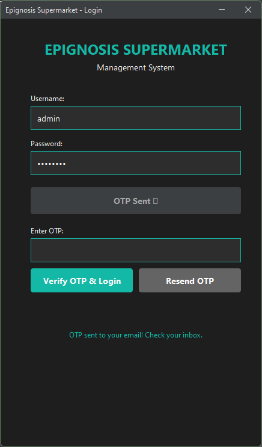
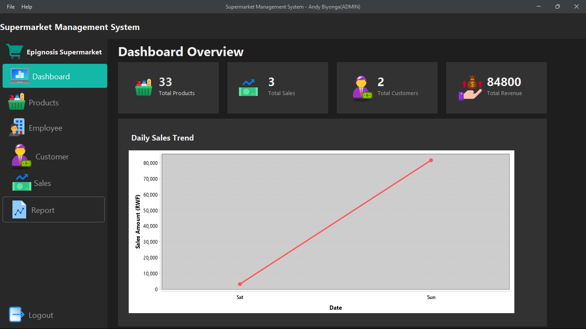
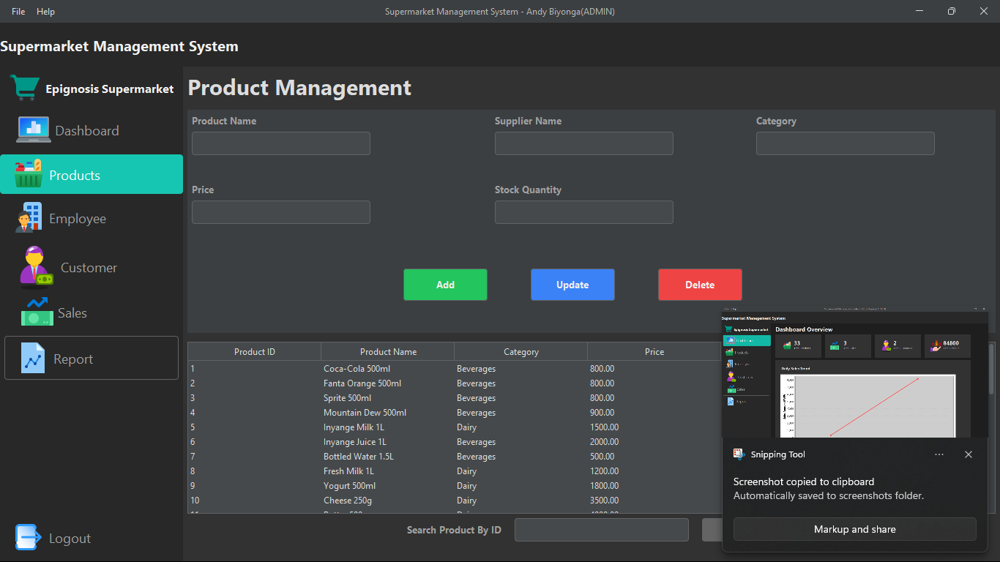
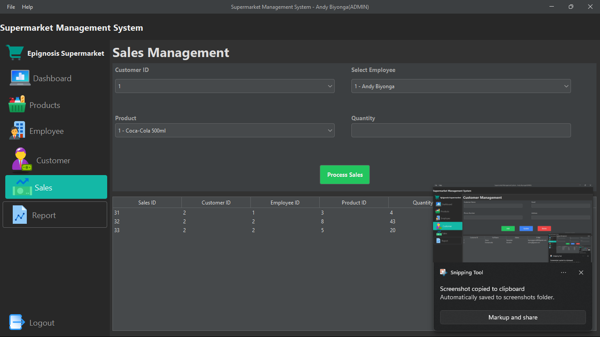
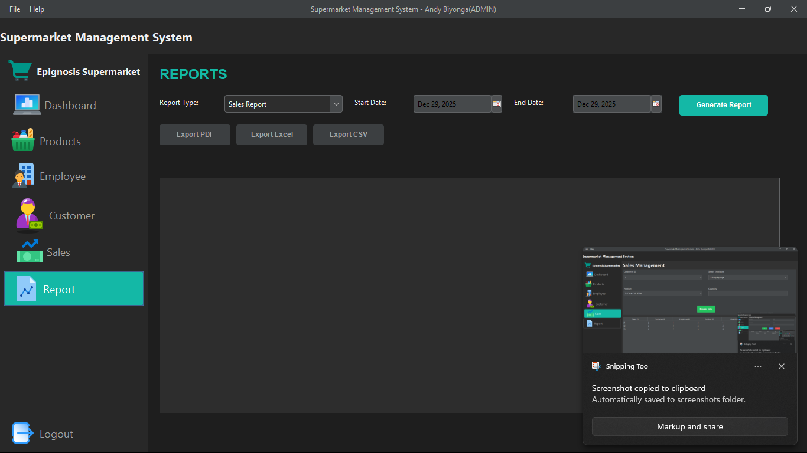

# Epignosis Supermarket Management System

A comprehensive distributed supermarket management system built with Java enterprise technologies, featuring client-server architecture, OTP authentication, and multi-format reporting capabilities.


## 📋 Table of Contents

- [Features](#features)
- [System Architecture](#system-architecture)
- [Technologies Used](#technologies-used)
- [Prerequisites](#prerequisites)
- [Installation](#installation)
- [Configuration](#configuration)
- [Usage](#usage)
- [Project Structure](#project-structure)
- [Database Schema](#database-schema)
- [Screenshots](#screenshots)
- [Contributing](#contributing)
- [License](#license)
- [Contact](#contact)

## ✨ Features

### Core Management Modules
- **Product Management**: Complete CRUD operations with category-based organization
- **Customer Management**: Customer profiles with purchase history tracking
- **Employee Management**: Staff management with role-based access and profile details
- **Sales Processing**: Point-of-sale system with real-time inventory updates
- **Supplier Management**: Vendor information and relationship tracking
- **Inventory Management**: Automated stock tracking with intelligent lifecycle rules
- **Reporting System**: Multi-format report generation (PDF, Excel, CSV)

### Advanced Features
- **OTP Authentication**: Secure email-based two-factor authentication using ActiveMQ message broker
- **Session Management**: Configurable timeout with automatic cleanup mechanisms
- **Distributed Architecture**: RMI-based client-server communication
- **Transaction Management**: ACID-compliant operations with automatic rollback
- **Data Validation**: Rwanda-specific format validation (phone numbers, emails, TIN)
- **Automated Inventory**: Intelligent product lifecycle management and stock alerts
- **Comprehensive Logging**: Multi-level logging with error tracking and audit trails

## 🏗️ System Architecture

The system follows a three-tier distributed architecture:

```
┌─────────────────────────────────────────┐
│         Client Tier (Swing UI)          │
│  - Management Panels                    │
│  - Authentication Interface             │
│  - Report Generation Views              │
└──────────────┬──────────────────────────┘
               │ RMI Communication
┌──────────────▼──────────────────────────┐
│       Business Logic Tier (RMI)         │
│  - Remote Service Implementations       │
│  - Session Management                   │
│  - Transaction Coordination             │
└──────────────┬──────────────────────────┘
               │ Hibernate ORM
┌──────────────▼──────────────────────────┐
│         Data Access Tier (DAO)          │
│  - Generic DAO Pattern                  │
│  - Entity-Specific DAOs                 │
│  - Database Operations                  │
└──────────────┬──────────────────────────┘
               │
┌──────────────▼──────────────────────────┐
│       MySQL Database (SSL/TLS)          │
└─────────────────────────────────────────┘
```

### Additional Components
- **ActiveMQ Message Broker**: Asynchronous OTP email delivery
- **JavaMail Integration**: SMTP-based email communication
- **iText PDF Engine**: Professional report generation
- **Apache POI**: Excel document processing
- **OpenCSV**: CSV export functionality

## 🛠️ Technologies Used

### Core Technologies
- **Java SE 8+**: Primary programming language
- **Hibernate 4.x**: ORM framework for database operations
- **Java RMI**: Remote Method Invocation for distributed computing
- **MySQL 8.0+**: Relational database management
- **Swing**: GUI framework for desktop application

### Libraries & Frameworks
- **ActiveMQ 5.17.3**: Message broker for asynchronous processing
- **JavaMail API**: Email delivery system
- **iText PDF**: PDF report generation
- **Apache POI**: Excel file manipulation
- **OpenCSV**: CSV data export
- **BCrypt**: Password hashing and security
- **Log4j**: Comprehensive logging framework
- **MySQL Connector/J**: JDBC driver

## 📦 Prerequisites

Before running this application, ensure you have the following installed:

- **Java Development Kit (JDK)**: Version 8 or higher
- **MySQL Server**: Version 8.0 or higher
- **Apache ActiveMQ**: Version 5.17.3 or compatible
- **Maven** (optional): For dependency management
- **IDE**: IntelliJ IDEA, Eclipse, or NetBeans

## 🚀 Installation

### 1. Clone the Repository

```bash
git clone https://github.com/yourusername/epignosis-supermarket.git
cd epignosis-supermarket
```

### 2. Database Setup

```sql
-- Create database
CREATE DATABASE epignosis_supermarket;

-- Import the schema
mysql -u root -p epignosis_supermarket < database/schema.sql

-- Import sample data (optional)
mysql -u root -p epignosis_supermarket < database/sample_data.sql
```

### 3. Configure MySQL SSL (Optional but Recommended)

```sql
-- Enable SSL in MySQL
ALTER USER 'your_user'@'localhost' REQUIRE SSL;
FLUSH PRIVILEGES;
```

### 4. Install Dependencies

All required JAR files are located in the `/lib` directory:

- `activation-1.1.1.jar`
- `activemq-all-5.17.3.jar`
- `bcrypt-0.9.0.jar`
- `commons-csv-1.8.jar`
- `hibernate-core-4.3.11.Final.jar`
- `itext-2.1.7.jar`
- `log4j-api-2.x.jar`, `log4j-core-2.x.jar`
- `mail-1.4.7.jar`
- `mysql-connector-java-8.0.x.jar`
- `poi-5.2.3.jar`, `poi-ooxml-5.2.3.jar`
- And other required dependencies

Add these to your classpath or use the provided build configuration.

### 5. ActiveMQ Setup

```bash
# Download and extract ActiveMQ
wget https://archive.apache.org/dist/activemq/5.17.3/apache-activemq-5.17.3-bin.tar.gz
tar -xzf apache-activemq-5.17.3-bin.tar.gz

# Start ActiveMQ
cd apache-activemq-5.17.3
bin/activemq start

# Verify it's running (default: http://localhost:8161/admin)
```

## ⚙️ Configuration

### 1. Hibernate Configuration (`hibernate.cfg.xml`)

```xml
<hibernate-configuration>
    <session-factory>
        <property name="hibernate.connection.driver_class">com.mysql.cj.jdbc.Driver</property>
        <property name="hibernate.connection.url">jdbc:mysql://localhost:3306/epignosis_supermarket?useSSL=true</property>
        <property name="hibernate.connection.username">your_username</property>
        <property name="hibernate.connection.password">your_password</property>
        <property name="hibernate.dialect">org.hibernate.dialect.MySQL8Dialect</property>
        <property name="hibernate.hbm2ddl.auto">update</property>
        <property name="hibernate.show_sql">true</property>
    </session-factory>
</hibernate-configuration>
```

### 2. Email Configuration (OTP System)

Update the email configuration in your properties file:

```properties
# Gmail SMTP Configuration
mail.smtp.host=smtp.gmail.com
mail.smtp.port=587
mail.smtp.auth=true
mail.smtp.starttls.enable=true
mail.smtp.username=your-email@gmail.com
mail.smtp.password=your-app-password

# OTP Configuration
otp.expiry.minutes=5
otp.length=6
```

**Note**: For Gmail, you need to generate an [App Password](https://support.google.com/accounts/answer/185833).

### 3. RMI Configuration

Configure RMI registry port in your server startup:

```java
// Default RMI port: 1099
Registry registry = LocateRegistry.createRegistry(1099);
```

### 4. Session Configuration

Adjust session timeout in your configuration:

```java
// Session timeout in milliseconds (default: 30 minutes)
private static final long SESSION_TIMEOUT = 30 * 60 * 1000;
```

## 💻 Usage

### Starting the System

#### 1. Start ActiveMQ

```bash
cd apache-activemq-5.17.3
bin/activemq start
```

#### 2. Start the RMI Server

```bash
java -cp ".:lib/*" com.epignosis.server.ServerMain
```

Or run the `ServerMain` class from your IDE.

#### 3. Start the Client Application

```bash
java -cp ".:lib/*" com.epignosis.client.ClientMain
```

Or run the `ClientMain` class from your IDE.

### Login Process

1. Launch the client application
2. Enter your registered email address
3. Click "Send OTP" to receive a verification code
4. Check your email for the 6-digit OTP
5. Enter the OTP within 5 minutes
6. Access the management dashboard

### Default Admin Account

For testing purposes:
- **Email**: `andybiyonga@gmail.com`
- **OTP**: Sent to registered email

### Core Operations

#### Product Management
- Add new products with categories and pricing
- Update product information and stock levels
- Delete discontinued products
- View product history and sales data

#### Sales Processing
1. Select customer from the database
2. Add products to cart with quantities
3. System automatically validates stock availability
4. Complete sale to update inventory
5. Generate sale receipt

#### Inventory Management
- View current stock levels across all products
- Receive automated low-stock alerts
- Track product lifecycle and turnover
- Manage supplier relationships

#### Report Generation
1. Navigate to Reports panel
2. Select report type (Sales, Inventory, Customer, etc.)
3. Choose date range and filters
4. Select export format (PDF, Excel, or CSV)
5. Generate and save report

## 📁 Project Structure

```
epignosis-supermarket/
│
├── src/
│   ├── main/
│   │   ├── java/
│   │   │   ├── com/epignosis/
│   │   │   │   ├── client/           # Client-side UI and logic
│   │   │   │   │   ├── panels/       # Management panels
│   │   │   │   │   ├── auth/         # Authentication UI
│   │   │   │   │   └── ClientMain.java
│   │   │   │   │
│   │   │   │   ├── server/           # Server-side RMI implementation
│   │   │   │   │   ├── rmi/          # Remote service implementations
│   │   │   │   │   ├── session/      # Session management
│   │   │   │   │   └── ServerMain.java
│   │   │   │   │
│   │   │   │   ├── dao/              # Data Access Objects
│   │   │   │   │   ├── GenericDAO.java
│   │   │   │   │   ├── ProductDAO.java
│   │   │   │   │   ├── CustomerDAO.java
│   │   │   │   │   └── ...
│   │   │   │   │
│   │   │   │   ├── model/            # Entity classes
│   │   │   │   │   ├── Product.java
│   │   │   │   │   ├── Customer.java
│   │   │   │   │   ├── Employee.java
│   │   │   │   │   └── ...
│   │   │   │   │
│   │   │   │   ├── service/          # Business logic layer
│   │   │   │   │   ├── interfaces/   # RMI service interfaces
│   │   │   │   │   └── impl/         # Service implementations
│   │   │   │   │
│   │   │   │   ├── util/             # Utility classes
│   │   │   │   │   ├── HibernateUtil.java
│   │   │   │   │   ├── ValidationUtil.java
│   │   │   │   │   ├── OTPUtil.java
│   │   │   │   │   └── EmailUtil.java
│   │   │   │   │
│   │   │   │   └── reports/          # Report generation
│   │   │   │       ├── PDFGenerator.java
│   │   │   │       ├── ExcelGenerator.java
│   │   │   │       └── CSVGenerator.java
│   │   │   │
│   │   └── resources/
│   │       ├── hibernate.cfg.xml     # Hibernate configuration
│   │       ├── log4j2.xml            # Logging configuration
│   │       └── application.properties
│   │
├── lib/                              # External JAR dependencies
│   ├── hibernate-core-4.3.11.Final.jar
│   ├── mysql-connector-java-8.0.x.jar
│   ├── activemq-all-5.17.3.jar
│   └── ...
│
├── database/
│   ├── schema.sql                    # Database schema
│   └── sample_data.sql               # Sample data for testing
│
├── docs/
│   ├── API_Documentation.md
│   ├── User_Manual.md
│   └── Architecture_Diagram.png
│
├── README.md
├── LICENSE
└── .gitignore
```

## 🗄️ Database Schema

### Key Entities and Relationships

#### ONE-TO-ONE Relationships
- **Employee ↔ EmployeeProfile**: Each employee has exactly one profile with additional details

#### ONE-TO-MANY Relationships
- **Customer → Sales**: One customer can have multiple sales
- **Employee → Sales**: One employee processes multiple sales
- **Supplier → Products**: One supplier provides multiple products
- **Category → Products**: One category contains multiple products

#### MANY-TO-MANY Relationships
- **Sale ↔ Product**: Many sales can include many products (via SaleItem junction table)

### Core Tables

```sql
-- Products Table
CREATE TABLE products (
    product_id INT PRIMARY KEY AUTO_INCREMENT,
    product_name VARCHAR(255) NOT NULL,
    category_id INT,
    price DECIMAL(10,2) NOT NULL,
    stock_quantity INT NOT NULL,
    supplier_id INT,
    created_at TIMESTAMP DEFAULT CURRENT_TIMESTAMP,
    FOREIGN KEY (category_id) REFERENCES categories(category_id),
    FOREIGN KEY (supplier_id) REFERENCES suppliers(supplier_id)
);

-- Sales Table
CREATE TABLE sales (
    sale_id INT PRIMARY KEY AUTO_INCREMENT,
    customer_id INT,
    employee_id INT,
    sale_date TIMESTAMP DEFAULT CURRENT_TIMESTAMP,
    total_amount DECIMAL(10,2) NOT NULL,
    FOREIGN KEY (customer_id) REFERENCES customers(customer_id),
    FOREIGN KEY (employee_id) REFERENCES employees(employee_id)
);

-- Sale Items (Junction Table)
CREATE TABLE sale_items (
    sale_item_id INT PRIMARY KEY AUTO_INCREMENT,
    sale_id INT,
    product_id INT,
    quantity INT NOT NULL,
    unit_price DECIMAL(10,2) NOT NULL,
    subtotal DECIMAL(10,2) NOT NULL,
    FOREIGN KEY (sale_id) REFERENCES sales(sale_id),
    FOREIGN KEY (product_id) REFERENCES products(product_id)
);
```

## 📸 Screenshots

### Login Screen with OTP Authentication


### Main Dashboard


### Product Management Panel


### Sales Processing Interface


### Report Generation


## 🤝 Contributing

Contributions are welcome! Please follow these guidelines:

1. Fork the repository
2. Create a feature branch (`git checkout -b feature/AmazingFeature`)
3. Commit your changes (`git commit -m 'Add some AmazingFeature'`)
4. Push to the branch (`git push origin feature/AmazingFeature`)
5. Open a Pull Request

### Coding Standards
- Follow Java naming conventions
- Write comprehensive JavaDoc comments
- Include unit tests for new features
- Maintain consistent code formatting
- Update documentation as needed

## 📄 License

This project is licensed under the MIT License - see the [LICENSE](LICENSE) file for details.

## 📧 Contact

**Andy (Andy Biyonga)**
- Email: andybiyonga@gmail.com
- GitHub: [@Andy-Bat54239](https://github.com/Andy-Bat54239)
- Project Link: [https://github.com/Andy-Bat54239/Supermarket_Management_System_RMI](https://github.com/Andy-Bat54239/Supermarket_Management_System_RMI)

## 🙏 Acknowledgments

- Academic institution for project guidance and requirements
- Hibernate team for excellent ORM framework
- Apache Software Foundation for ActiveMQ
- iText developers for PDF generation capabilities
- All contributors and testers who helped improve this system

## 📊 Project Statistics

- **Total Lines of Code**: ~15,000+
- **Number of Classes**: 50+
- **Database Tables**: 12
- **API Endpoints**: 30+ RMI methods
- **Test Coverage**: Comprehensive manual testing
- **Development Time**: Academic semester project

---

**Note**: This is an academic project demonstrating enterprise Java technologies and distributed system architecture. It serves as a learning platform for advanced Java development concepts.

**Academic Use**: This project meets specific academic requirements including:
- ✅ Distributed client-server architecture (RMI)
- ✅ All three database relationship types (ONE-TO-ONE, ONE-TO-MANY, MANY-TO-MANY)
- ✅ ORM implementation (Hibernate)
- ✅ Advanced authentication (OTP via message broker)
- ✅ Comprehensive CRUD operations
- ✅ Professional UI design
- ✅ Multi-format reporting capabilities
- ✅ Transaction management and ACID compliance

For questions, issues, or feature requests, please open an issue on GitHub or contact the developer directly.
